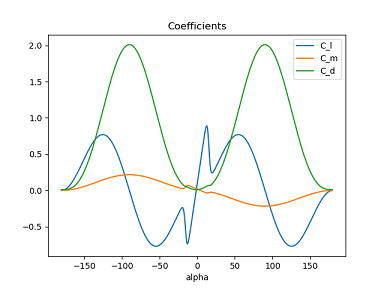
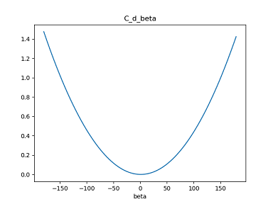

# PyFly - Python Fixed Wing Flight Simulator
PyFly is a python implementation of a 6 DOF aerodynamic model for fixed wing aircraft. PyFly uses
quaternions internally for performance reasons and to avoid singularities, while constraints and initial conditions can be
specified in euler angles for convenience.

PyFly simulates the effects of wind and stochastic turbulence, modeled with the Dryden turbulence model.

A simple PID-controller tuned to the Skywalker X8 UAV is included for convenience and sanity checks.

The base aircraft parameters must be specified through a parameter file. An example of such a file experimentally verified
by wind tunnel testing is included for the Skywalker X8 UAV, courtesy of <https://github.com/krisgry/x8>.

Aerodynamic coefficients in PyFly contain nonlinear extensions in angle of attack and sideslip angle, designed with 
Newtonian flat-plate-theory, in an effort to extend model-validity in the state space and incorporate effects such as stall:



## Example

```python
from pyfly import PyFly
from pid_controller import PIDController

sim = PyFly("pyfly_config.json", "x8param.mat")
sim.seed(0)

sim.reset(state={"roll": -0.5, "pitch": 0})

pid = PIDController(sim.dt)
pid.set_reference(0.2, -0.1, 22)

for step_i in range(500):
    phi = sim.state["roll"].value
    theta = sim.state["pitch"].value
    Va = sim.state["Va"].value
    omega = [sim.state["omega_p"].value, sim.state["omega_q"].value, sim.state["omega_r"].value]

    action = sim.get_action(phi, theta, Va, omega)
    # Simulator expects [elevator, aileron, rudder, throttle] while PID is adapted to X8 which lacks rudder.
    action = [action[0], action[1], 0, action[2]]  
    success = sim.step(action)

    if not success:
        break

sim.render()
```

Rendering this scenario produces:


## Documentation
PyFly is highly configurable through its config json file. All model states must be declared in this file, and be on the
following form:
```text
    "dt": 0.01,           # REQUIRED The integration duration for each call to step()
    "g": 9.81,            # REQUIRED The gravational constant
    "rho": 1.2250,        # REQUIRED The permutativity of air
    "turbulence": true,   # REQUIRED Wether turbulence (from Dryden Turbulence model) is enabled
    "turbulence_intensity": "light", # REQUIRED The intensity of the turbulence. One of "light", "moderate", "severe"
    "states": [   # REQUIRED: Declaration of states in model
      {
        "name": "roll",    # REQUIRED: Name of state
        "unit": "degrees", # The unit of the state for plotting purposes
        "init_min": -30,   # The minimum initial value of the state
        "init_max": 30,    # The maximum initial value of the state
        "value_min": -60   # The minimum value the state can be in, e.g. by physical constraints
        "value_max": 60    # Maximum value the state can be in
        "convert_to_radians": true, # If state properties are given in degrees
        "wrap": true, # For angle variables, whether to wrap variable in [-pi, pi]
        "label": "r"  # The label of the state for plotting purposes
      },
      # ACTUATOR STATES
      {
        "name": "elevator",
        "constraints_min": -60 # Violating this value will cause the simulation to end, e.g. for unfeasable flight scenarios
        "constraints_max": 60  # Upper constraint limit
        "order": 2 # REQUIRED FOR CONTROL STATE The order of the actuator dynamics, one of 1 or 2
        "omega_0": 100 # Omega_0 for second order actuator dynamics
        "zeta": 1.71  # Zeta for second order actuator dynamics
        "tau": 5 #  Time constant for first order actuator dynamics
        "disabled": false, # Wether the actuator is disabled, i.e. not present on the specific aircraft
        "dot_max": 3.497, # Constraint on magnitude of derivative of state for second order actuator dynamics.
      }
    ],
   "plots": [  # Plots can easily be constructed through the plot argument
     {
      "title": "Angle of Attack, Sideslip Angle and Airspeed", # REQUIRED Title of plot
      "x_unit": "timesteps",                                   # REQUIRED The unit of the x-axis, one of "timesteps" or "seconds".
      "variables": ["alpha", "beta", "Va"]                     # REQUIRED The variables in the plot
      "plot_quantity": "value"                                 # What state quantity to plot, one of "value", "dot" or "command".
     },
   ]
```

## Citation
If you use this software, please cite:

```text
@inproceedings{drl_attitude_control,
    author={Bøhn, Eivind and Coates, Erlend M. and Moe, Signe and Johansen, Tor Arne},
    title={Deep Reinforcement Learning Attitude Control of Fixed-Wing UAVs Using Proximal Policy Optimization},
    year={2019},
}
```


